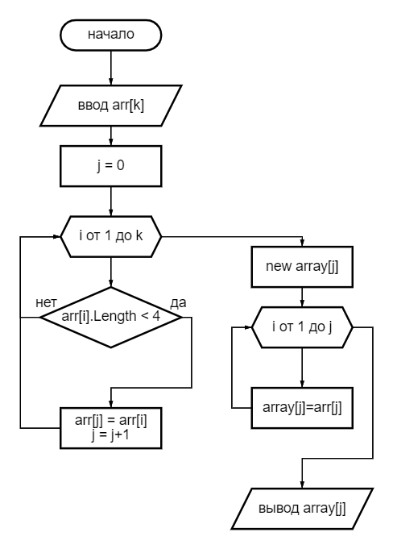

# __Итоговая проверочная работа.__

1. Создать репозиторий на GitHub.
2. Нарисовать блок схему алгоритма.
3. Снабдить репозиторий оформленным текстовым описанием решения(файл README.md).
4. Написать программу, решающую поставленную задачу.
5. Использовать контроль версий в работе над этим проектом.
## Задача
*Написать программу, которая из имеющегося массива строк формирует массив строк, длина которых меньше либо равна 3 символа. Первоначальный массив можно ввести с клавиатуры или задать в начале алгоритма. При решении рекомендуетmся пользоваться исключительно массивами.*
## Решение.
Создаем папку и с помощью VScode инициализируем там Git.
### Блок схема.

